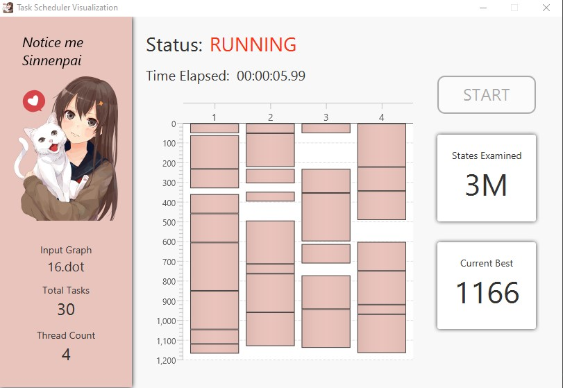

# Visualization
As part of milestone 2, a visualization of the scheduling algorithm was added.
This can be enabled by including the `-v` flag when running the program.

## Goals
The goals of the visualization were to provide a meaningful reflection of the algorithm,
as it exhaustively searches the possible schedules. We wanted to include both a visual 
representation of the partial schedules created, as well as some informative statistics 
about the execution of the algorithm.'
## Solution
The interface for the visualization is shown below:

The main chart displays the partial schedule, which is being searched by the algorithm.
This is updated live as the algorithm executes, along with the time elapsed, states 
searched, tasks scheduled, and best finishing time found so far.

## Implementation
[JavaFX](https://openjfx.io/) was used, along with 
[Scene Builder](https://gluonhq.com/products/scene-builder/) in order to easily 
integrate with the rest of the project and speed up development. To convert the 
project into a java application, we made the `Driver` class extend 
`javafx.application.Application`. If the `-v` flag is received, we launch the 
application. The `Controller` class encapsulates the logic of the GUI, while the 
visual components are described in `visualisation-view.fxml`.

### Multi-threading
The application runs on the main GUI thread, which is automatically managed by JavaFX 
to poll for events. The solution thus needs to run on background threads, and update 
the polling GUI thread. We achieved this by refactoring the algorithm processing into 
subclasses of `javafx.concurrent.Task`. This is explained in more detail 
[here](./Parallelisation.md).

## Issues
The algorithm runs very quickly with a few nodes (<14) and/or processors, so the live 
updates to the GUI can be hard to see.
